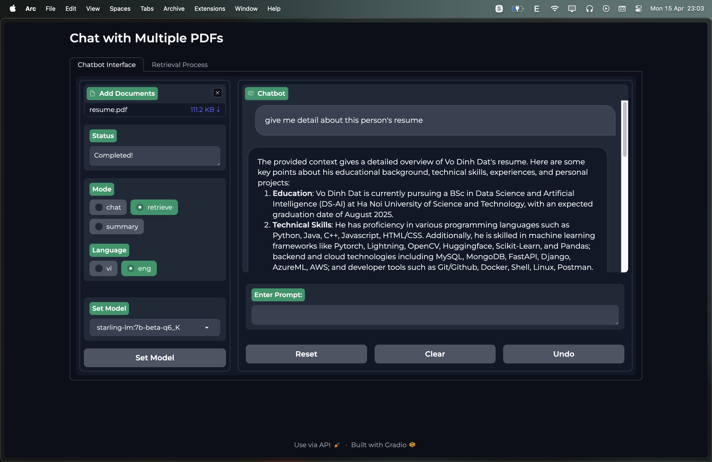
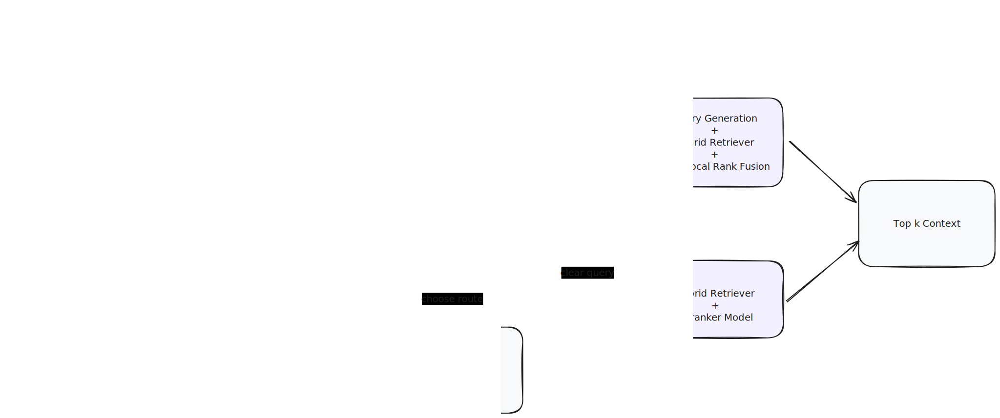

# 🤖 Chat with multiple PDFs locally



# 📖 Table of Contents

- [`Feature`](#⭐️-features)
- [`Idea`](#-idea)
- [`Setup`](#💻-setup)
  - [`Kaggle`](#1-kaggle-recommended)
  - [`Local`](#2-local)
    - [`Clone`](#21-clone-project)
    - [`Install`](#22-install)
    - [`Run`](#23-run)
- [`Todo`](#🎯-todo)

# ⭐️ Key Features

- Easy to run on `Local` or `Kaggle` (new)
- Using any model from `Huggingface` and `Ollama`
- Process multiple PDF inputs.
- Chat with multiples languages (Coming soon).
- Simple UI with `Gradio`.

# 💡 Idea (Experiment)




# 💻 Setup

## 1. Kaggle (Recommended)

- Import [`notebooks/kaggle.ipynb`](notebooks/kaggle.ipynb) to Kaggle
- Replace `<YOUR_NGROK_TOKEN>` with your tokens.

## 2. Local

### 2.1. Clone project

```bash
git clone https://github.com/datvodinh/rag-chatbot.git
cd rag-chatbot
```

### 2.2 Install

#### 2.2.1 Docker

```bash
docker compose up --build
```

#### 2.2.2 Using script (Ollama, Ngrok, python package)

```bash
source ./scripts/install_extra.sh
```

#### 2.2.3 Install manually

##### 1. `Ollama`

- MacOS, Window: [Download](https://ollama.com/)

- Linux

```bash
curl -fsSL https://ollama.com/install.sh | sh
```

##### 2. `Ngrok`

- Macos

```bash
brew install ngrok/ngrok/ngrok
```

- Linux

```bash
curl -s https://ngrok-agent.s3.amazonaws.com/ngrok.asc \
| sudo tee /etc/apt/trusted.gpg.d/ngrok.asc >/dev/null \
&& echo "deb https://ngrok-agent.s3.amazonaws.com buster main" \
| sudo tee /etc/apt/sources.list.d/ngrok.list \
&& sudo apt update \
&& sudo apt install ngrok
```

##### 3. Install `rag_chatbot` Package

```bash
source ./scripts/install.sh
```

### 2.3 Run

```bash
source ./scripts/run.sh
```

or

```bash
python -m rag_chatbot --host localhost
```

- Using Ngrok

```bash
source ./scripts/run.sh --ngrok
```

### 3. Go to: `http://0.0.0.0:7860/` or Ngrok link after setup completed

## 🎯 Todo

- [x] Add evaluation.
- [x] Better Document Processing.
- [ ] Support better Embedding Model for Vietnamese and other languages.
- [ ] ReAct Agent.
- [ ] Document mangement (Qrdant, MongoDB,...)

## 🌟 Star History

[](https://star-history.com/#datvodinh/rag-chatbot&Date)
