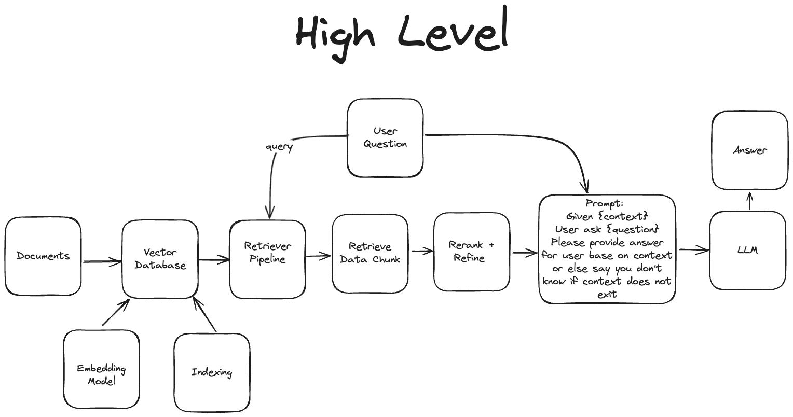
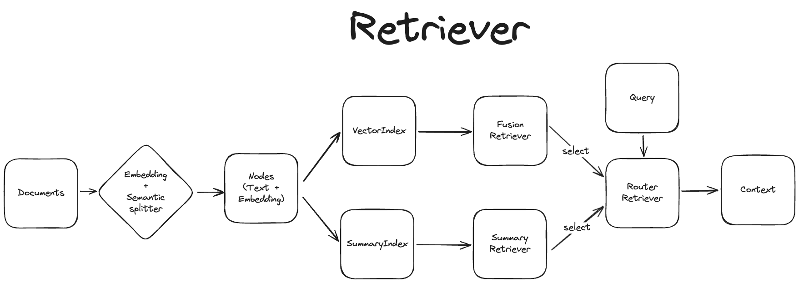

# Chat with multiple PDFs, using Ollama and LlamaIndex


## Setup

### Install Ollama

#### Linux

```bash
curl -fsSL https://ollama.com/install.sh | sh
```

#### MacOS

- [Download](https://ollama.com/)

### Clone project

```bash
git clone https://github.com/datvodinh/rag-chatbot.git
cd rag-chatbot
```

### Local

- Install

```bash
pip install .
```

- Run

```bash
python app.py --host localhost
```

- Go to: `http://0.0.0.0:7860/` after setup completed!

### Docker

- Build

```bash
docker compose up --build
```

- Go to: `http://0.0.0.0:7860/` after setup completed!

### Use OpenAI API

- Create file `.env` and input:

```bash
OPENAI_API_KEY = "[YOUR API KEY]"
```

## Todo List

- Support better Embedding Model for Vietnamese.
- Knowledge Graph (for Structure Data).
- Better Document Processing.

## Overview RAG Pipeline (Beta)

- High Level



- Retriever

